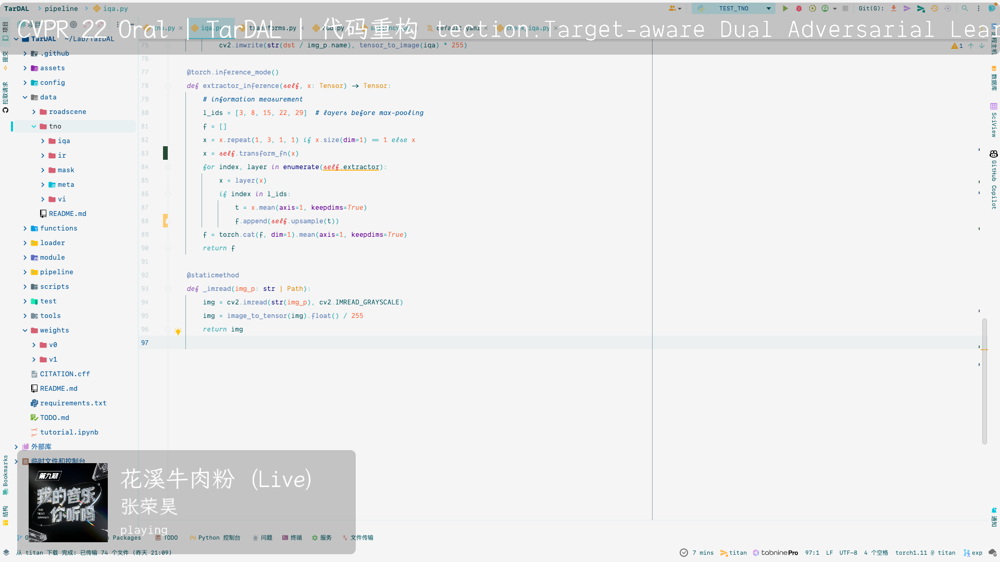

# Music Helper

An obs helper tool for macOS with Apple Music. Available for macOS 13+ (maybe for 12+).

The current track information will be obtained by this project and output to text and image files for obs to view.

## Usage

Package Requirements: `schedule==1.1.0` (for refresh track every 2s)

```shell
python3 main.py --dst ${WHERE_TO_OUTPUT}
```

## Preview



## Features

- [x]  **free and open source**
- [x] work without analyzing `Control Center - Now Playing`

## License

[MIT License](LICENSE)
